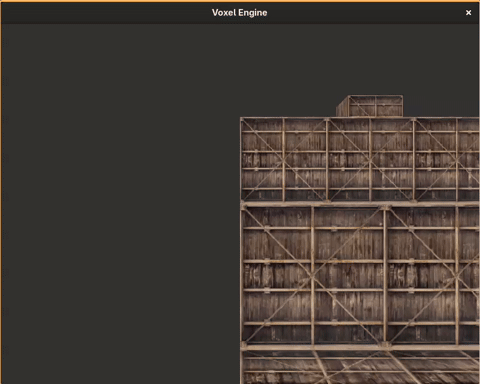
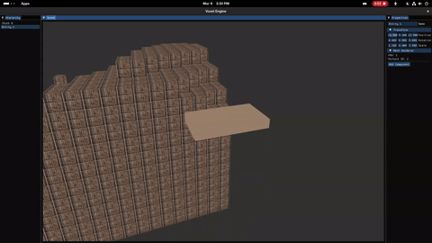

# Voxel Engine (OpenGL, C++)

## Examples

### Chunks


*giphy downscaled fps and quality*

### Cubes 


*giphy downscaled fps and quality*

### Terrain Generation 


*giphy downscaled fps and quality*

### Game Engine 


*giphy downscaled fps and quality*

## Compile & Run (All in one)
```
make && cd dist/ && ./voxel-engine
```

### Keybinds
- Movement: WASD
- Look Around: Mouse
- Toggle Wireframe: ;

## Progress (More tasks may be added here)
- ~~ECS (Entity Component System)~~
- ~~Chunks~~
- ~~Perlin Noise~~
- ~~Terrain generation (Perlin noise)~~
- Chunk generation (Minecraft-like)
- Block placing/breaking (runtime voxel modification)
- Mesh loader (for placing non-voxel models in the scene)
- Collision
- Multiple block types + texture atlas
- Lighting (ambient occlusion or basic directional)
- ~~ImGui Engine interface~~ (REFER TO IMGUI SECTION BELOW)
  - ~~Scene hierarchy~~
    - ~~Create Entity's~~
  - ~~Component inspector~~
  - Asset browser
  - Play/Stop mode

## IMGUI
Currently with the imgui interface being implemented it starting to look like a game engine. Know I think i will be doing a full engine rewrite and only adding imgui later, not that it was hard but rather that I don't know how I would handle saving engine scenes, exporting the game to a executable with custom player scripts, and etc. Also I learned quite a bit on how abstraction works and that has lead me to first wanting to be able to make a game using this engine without any UI then in the future implementing the UI. But who knows everything might change and I might just learn fast enough to want to implement the UI before.

## How did I learn?
I followed the getting started tutorial on [LearnOpenGL](https://learnopengl.com/Getting-started/OpenGL). I highly recommend doing the exercises because they seem stupid but you learn so much from them.

## Is this project finished?
No, its nowhere near finished I plan on implementing a ~~ECS (Entity Component System)~~ (Finished) and using ImGui to control the editor. I still have no idea on how I would approach building the game from the engine, collision detection, terrain generation, model loading into voxels, etc.

## Should you learn opengl?
It depends on if you want to make a game within a year or two or if you want to spend 2 years on a engine then 1 year on a game. I personally want to make my own game engine I can use on any game. Therefore I am willing to spend 2 years making a game engine then using it on every game I make.
